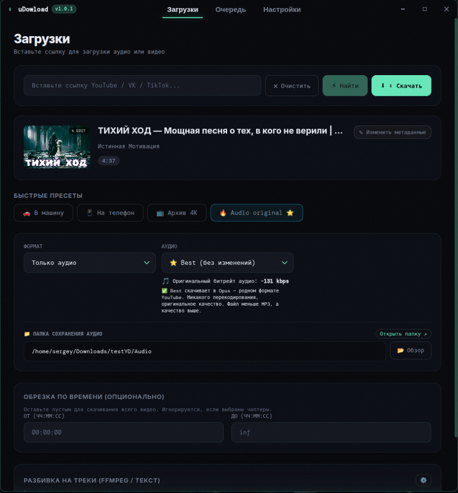
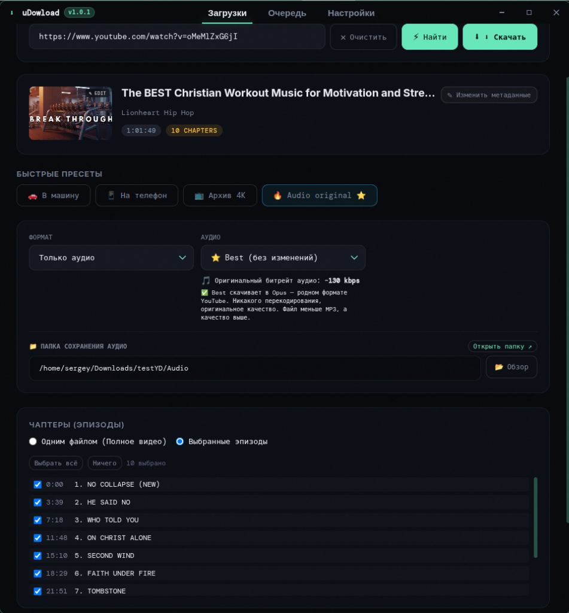
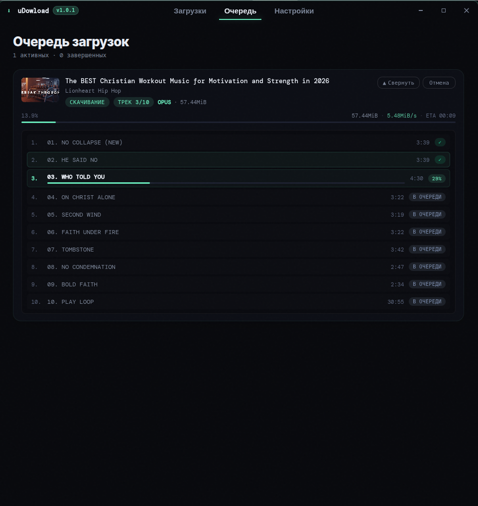
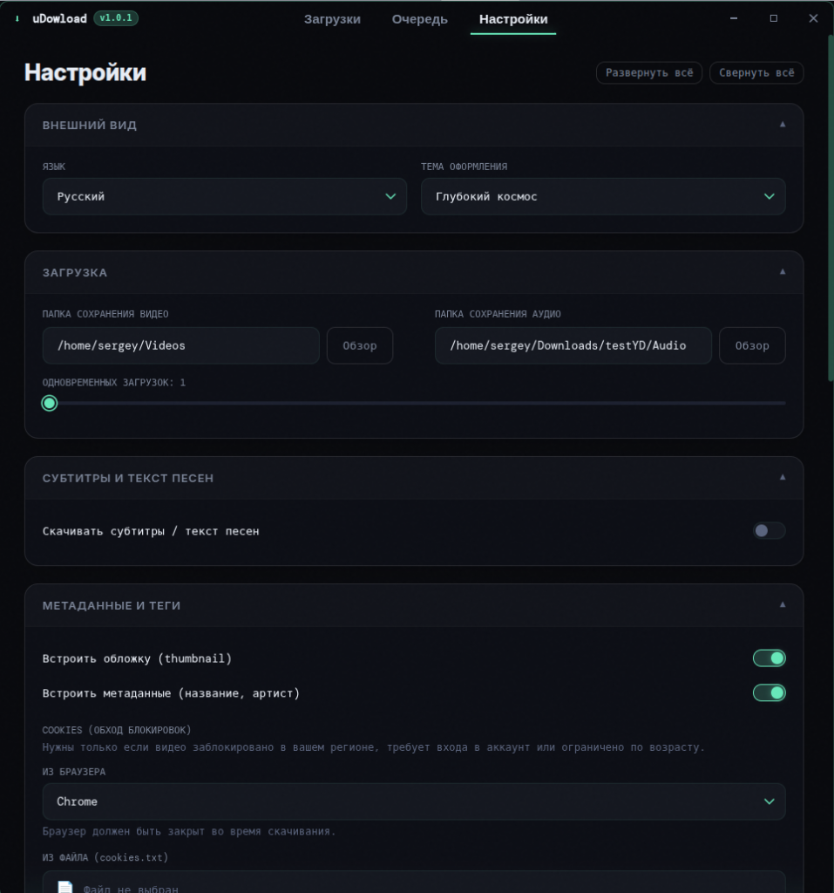

# uDowload ⚡

<p align="center">
  
</p>

<p align="center">
  <b>Современное, быстрое и мощное настольное приложение для скачивания видео, аудио и альбомов с YouTube, VK, Rutube, TikTok и более 1000 других сервисов.</b>
</p>

<p align="center">
  
  
  
  
  
  
</p>

---

## 📸 Скриншоты интерфейса

<table align="center">
  <tr>
    <td width="50%" align="center">
      <b>Главный экран загрузчика</b><br/>
      
    </td>
    <td width="50%" align="center">
      <b>Выбор глав и эпизодов YouTube</b><br/>
      
    </td>
  </tr>
  <tr>
    <td width="50%" align="center">
      <b>Очередь загрузок с детальным прогрессом</b><br/>
      
    </td>
    <td width="50%" align="center">
      <b>Сворачиваемые секции настроек</b><br/>
      
    </td>
  </tr>
</table>

---

## 🌟 Ключевые возможности («Плюшки»)

### 🎬 Видео и аудио максимального качества
- **Любые разрешения:** от 144p до **4K, 8K, 60fps и HDR** (MP4, MKV, WebM).
- **Чистый звук без потерь:** скачивание исходного аудиопотока (**Opus / M4A**) без перекодирования или конвертация в **MP3 (до 320 kbps)**, **FLAC**, **WAV**, **M4A**.
- **1000+ поддерживаемых сайтов:** YouTube, VK Видео, Rutube, TikTok, Twitch, Vimeo, SoundCloud, Twitter/X, Bilibili и многие другие (на базе актуального движка `yt-dlp`).

### 🎵 Умная нарезка альбомов на треки
- **Автоматическое распознавание треков:** приложение автоматически сканирует описание видео и закреплённые комментарии автора на наличие таймкодов треклиста.
- **Интерактивный редактор треков:** возможность прямо в интерфейсе переименовывать композиции, корректировать тайминги начала и окончания, добавлять новые или удалять ненужные треки перед загрузкой.
- **Встраивание обложек и ID3-тегов:** обложка видео и теги (название, артист, номер трека) автоматически вшиваются в каждый нарезанный аудиофайл.
- **Упаковка в альбом:** все треки аккуратно складываются в отдельную папку с созданием иконки обложки (`folder.jpg`, `cover.png`).

### ⏱️ Главы YouTube и точная обрезка по времени
- **YouTube Chapters:** удобный выбор нужных эпизодов чекбоксами (можно скачать всё видео целиком либо только выбранные главы отдельными файлами).
- **Обрезка по таймингу:** указание точного диапазона (`ОТ` — `ДО` с точностью до секунды). Загружается **только нужный отрезок**, без скачивания видео целиком.

### 📑 Плейлисты и каналы
- Скачивание плейлистов и коллекций видео целиком.
- Возможность указать диапазон загрузки (например, с 1 по 10 видео).
- Детальный статус по каждому видео и общий суммарный прогресс-бар.

### ⭐ Умные пресеты в один клик
- Готовые заводские профили:
  - 🚗 **В машину:** аудио, MP3 320k со встраиванием обложки и тегов.
  - 📱 **На телефон:** видео 720p для экономии трафика и памяти.
  - 📺 **Архив 4K:** максимальное качество видео и лучший звук.
  - 🔥 **Audio original:** исходный оригинальный звук YouTube (Opus) без потерь качества.
- Создание собственных пресетов с любыми комбинациями параметров.
- **Пресет по умолчанию при запуске:** возможность выбрать пресет со звёздочкой ⭐, который автоматически применяется при каждом открытии программы.

### 📋 Перехват буфера обмена (Clipboard Watcher)
- Скопировали ссылку на поддерживаемое видео в браузере — **uDowload мгновенно перехватывает её** и подтягивает метаданные.

### 🍪 Обход блокировок и приватные видео (Cookies)
- Прямой импорт cookies из браузеров: **Chrome, Edge, Firefox, Brave, Vivaldi, Opera, Safari**.
- Поддержка ручного указания файла `cookies.txt`.
- Позволяет скачивать видео с возрастным ограничением (18+), закрытые плейлисты и контент для спонсоров.

### 💬 Субтитры и тексты песен
- Скачивание субтитров на любых языках (включая автоматические субтитры и автоперевод).
- Встраивание субтитров в контейнер или сохранение отдельными файлами (`.srt` / `.vtt`).

### 🚀 Продвинутая очередь загрузок
- Многопоточное скачивание с ограничением количества одновременных задач.
- Отображение текущей скорости в реальном времени, оставшегося времени (ETA), скачанного и общего объёма.
- Управление задачами: пауза, возобновление, отмена.
- Быстрый переход к скачанному файлу или открытие папки прямо из карточки задачи.
- Выбор папки назначения прямо на главном экране («Обзор» / «Открыть папку»).

### ⚙️ Встроенный менеджер компонентов (FFmpeg и yt-dlp)
- **Выбор источника FFmpeg:** переключение между системным FFmpeg и автономной актуальной сборкой **FFmpeg 9.0+ от BtbN**.
- Автоматическая и ручная проверка обновлений компонентов прямо из настроек с отображением прогресс-бара скачивания и версий.

### 🎨 Премиальный Glassmorphism интерфейс
- Глубокая тёмная тема («Глубокий космос») и светлая тема оформления.
- **Сворачиваемые секции настроек (аккордеон)**: 8 аккуратных категорий, свернуты по умолчанию, с запоминанием состояния пользователя в `localStorage`.
- Кнопки быстрого сворачивания и разворачивания всех секций.
- Отображение актуальной версии приложения в шапке окна.

### 💻 Кроссплатформенность и архитектуры
- **Windows:** инсталлятор `.exe` (NSIS) с ярлыками и интеграцией.
- **Linux:** переносимый `.AppImage` и пакет `.deb`.
- **macOS:** **Universal Binary** (`.dmg` и `.zip`), нативно работающий как на процессорах **Apple Silicon (M1/M2/M3/M4)**, так и на Mac с процессорами **Intel**.

---

## 📥 Скачать приложение

Готовые установочные пакеты доступны на странице релизов:
👉 **[Скачать свежий релиз на GitHub Releases](https://github.com/flatisqa/uDownload/releases)**

| Платформа | Формат | Описание |
| :--- | :--- | :--- |
| 🪟 **Windows** | `.exe` (setup / portable) | Установщик или переносная версия без установки (64-bit) |
| 🍏 **macOS** | `.dmg` / `.zip` | **Universal** (для Apple Silicon M1-M4 и Intel) |
| 🐧 **Linux** | `.AppImage` / `.deb` | Для Ubuntu, Debian, Fedora, Arch и др. |

---

## 🛠️ Разработка и сборка

### Требования
- Node.js 20+
- npm 10+

### Установка и запуск

```bash
# 1. Клонировать репозиторий
git clone https://github.com/flatisqa/uDownload.git
cd uDownload

# 2. Установить зависимости
npm install

# 3. Запустить в режиме разработки (Hot-reload)
npm run dev
```

### Сборка приложения

```bash
# Проверка типов и линтинг
npm run typecheck
npm run lint

# Сборка под вашу текущую ОС
npm run build

# Сборка дистрибутивов:
npm run build:win     # Windows (.exe, .msi, .zip)
npm run build:mac     # macOS Universal (.dmg, .zip)
npm run build:linux   # Linux (.AppImage, .deb)
```

---

## 🏗️ Стек технологий

- **Фреймворк:** [Electron](https://www.electronjs.org/) + [electron-vite](https://electron-vite.org/)
- **Интерфейс:** [React 19](https://react.dev/), TypeScript, Vanilla CSS (Glassmorphism design system)
- **Управление состоянием:** [Zustand](https://github.com/pmndrs/zustand)
- **Движок загрузок:** [yt-dlp](https://github.com/yt-dlp/yt-dlp)
- **Медиа-процессор:** [FFmpeg](https://ffmpeg.org/) (сборки BtbN)
- **Сборщик дистрибутивов:** [electron-builder](https://www.electron.build/)

---

## 📄 Лицензия

Проект распространяется под лицензией [MIT](LICENSE).
